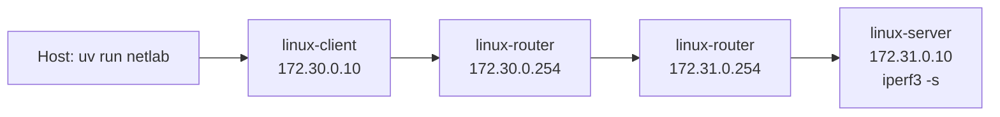

# linux-network-validation-lab

Reproducible Linux network validation lab for automated connectivity, latency, packet-loss,
throughput, and fault-injection testing.

This project exists to provide a compact systems integration test bed where network behavior can be
changed intentionally, measured consistently, and reported in a form that is useful for engineering
review. It is not a production monitoring system, carrier-grade test platform, or cybersecurity lab.

## Architecture

The host runs the `netlab` Python CLI. Docker Compose creates three Linux containers with static
addresses and an explicit routed path. The CLI applies `tc/netem` faults on the router, executes
Linux network tools from the client container, validates results against scenario thresholds, and
writes machine-readable and HTML outputs.



## Topology

| Node | Role | Network |
| --- | --- | --- |
| `linux-client` | Test controller for `ping`, `iperf3`, `traceroute`, optional `tcpdump` | `172.30.0.10/24` |
| `linux-router` | Linux forwarding node and `tc/netem` fault injection point | `172.30.0.254/24`, `172.31.0.254/24` |
| `linux-server` | Test endpoint running `iperf3 --server` | `172.31.0.10/24` |

## Quick Start

Requirements:

- Python 3.11
- `uv`
- Docker and Docker Compose

```bash
uv sync
uv run netlab --help
docker compose up -d
docker compose ps
uv run netlab run --scenario configs/baseline.yaml
uv run netlab report --input reports/results.json --output reports/example_report.html
docker compose down
```

The same lifecycle is available through the CLI:

```bash
uv run netlab up
uv run netlab run --scenario configs/packet_loss.yaml
uv run netlab down
```

## Running Scenarios

Scenario files live in `configs/`:

- `baseline.yaml`: no impairment
- `latency_degradation.yaml`: injected egress delay on the router
- `packet_loss.yaml`: controlled packet loss on the router
- `bandwidth_limit.yaml`: router egress rate limitation

Each scenario defines the target host, expected routed hops, test parameters, fault-injection
parameters, and validation thresholds. A run writes:

- `reports/results.json`
- `reports/results.csv`
- optional `reports/captures/*.pcap` when capture is enabled in the scenario

## Fault Injection

Faults are applied on `linux-router` with Linux `tc/netem`. The default impairment interface is
`eth1`, the router interface facing the server network.

Supported impairments:

- Delay: `netem delay <N>ms`
- Packet loss: `netem loss <N>%`
- Bandwidth limitation: `netem rate <N>mbit`

The CLI clears the existing root qdisc before applying a scenario so repeated runs do not inherit
stale fault state.

## Test Strategy

The validation run executes:

- ICMP latency and packet-loss test with `ping`
- TCP throughput test with `iperf3`
- Hop validation with `traceroute`
- Optional packet capture with `tcpdump`

Python unit tests cover configuration validation, command generation, parser behavior, threshold
validation, and report generation. CI runs `ruff`, `mypy`, and `pytest`.

## Reports

Generate an HTML report from the latest JSON results:

```bash
uv run netlab report --input reports/results.json --output reports/example_report.html
```

The report includes an executive summary, scenario configuration, topology, fault parameters, test
results, threshold validation, engineering interpretation, troubleshooting recommendations, and raw
command summary.

## Limitations

- Results are scoped to a Docker-based Linux lab on the local host.
- Container networking does not represent all physical network behaviors.
- Throughput depends on host resources, Docker networking, and concurrent system load.
- `tc/netem` impairment is applied at the configured router interface only.
- This is a validation harness, not continuous production monitoring.

## Troubleshooting

Check container state:

```bash
docker compose ps
```

Inspect routes:

```bash
docker exec linux-client ip route
docker exec linux-router ip route
docker exec linux-server ip route
```

Inspect active fault injection:

```bash
docker exec linux-router tc qdisc show dev eth1
```

Reset the lab:

```bash
docker compose down
docker compose up -d --build
```
