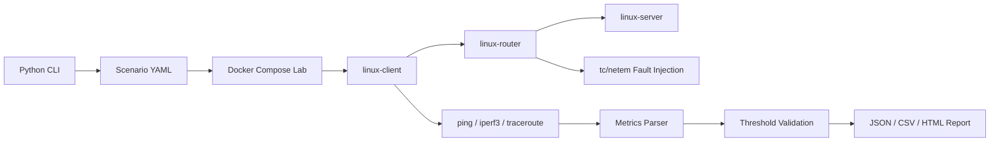
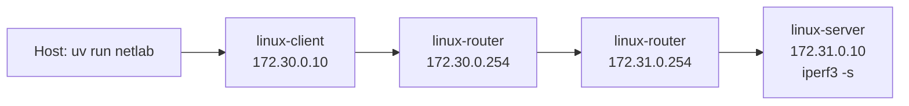

# linux-network-validation-lab

Reproducible Linux network validation lab for automated connectivity, latency, packet-loss,
throughput, and fault-injection testing.

This project exists to provide a compact systems integration test bed where network behavior can be
changed intentionally, measured consistently, and reported in a form that is useful for engineering
review. This project is a reproducible Linux-based network validation lab, not a production
monitoring platform.



## What this project is

- a reproducible Linux network validation lab
- a test automation and fault-injection workflow
- a CLI-based engineering tool
- a portfolio project for systems, test, integration, and infrastructure roles

## What this project is not

- a production network monitoring platform
- a carrier-grade telecom simulator
- a replacement for lab-grade traffic generators
- a cybersecurity project
- a full observability stack

## Architecture

The host runs the `netlab` Python CLI. Docker Compose creates three Linux containers with static
addresses and an explicit routed path. The CLI applies `tc/netem` faults on the router, executes
Linux network tools from the client container, validates results against scenario thresholds, and
writes machine-readable and HTML outputs.



## Topology

| Node | Role | Network |
| --- | --- | --- |
| `linux-client` | Test controller for `ping`, `iperf3`, `traceroute`, optional `tcpdump` | `172.30.0.10/24` |
| `linux-router` | Linux forwarding node and `tc/netem` fault injection point | `172.30.0.254/24`, `172.31.0.254/24` |
| `linux-server` | Test endpoint running `iperf3 --server` | `172.31.0.10/24` |

## Quick Start

Requirements:

- Python 3.11
- `uv`
- Docker and Docker Compose
- A Docker environment that supports `NET_ADMIN` and Linux traffic control (`tc/netem`)

```bash
uv sync
uv run netlab --help
docker compose up -d
docker compose ps
uv run netlab run --scenario configs/baseline.yaml
uv run netlab run --scenario configs/latency_degradation.yaml
uv run netlab run --scenario configs/packet_loss.yaml
uv run netlab run --scenario configs/bandwidth_limit.yaml
uv run netlab report --input reports/results.json --output reports/example_report.html
docker compose down
```

The same lifecycle is available through the CLI:

```bash
uv run netlab up
uv run netlab run --scenario configs/packet_loss.yaml
uv run netlab down
```

## Running Scenarios

Scenario files live in `configs/`:

- `baseline.yaml`: no impairment
- `latency_degradation.yaml`: injected egress delay on the router
- `packet_loss.yaml`: controlled packet loss on the router
- `bandwidth_limit.yaml`: router egress rate limitation

Each scenario defines the target host, expected routed hops, test parameters, fault-injection
parameters, and validation thresholds. A run writes:

- `reports/results.json`
- `reports/results.csv`
- optional `reports/captures/*.pcap` when capture is enabled in the scenario

## Fault Injection

Faults are applied on `linux-router` with Linux `tc/netem`. The default impairment interface is
`eth1`, the router interface facing the server network.

Supported impairments:

- Delay: `netem delay <N>ms`
- Packet loss: `netem loss <N>%`
- Bandwidth limitation: `netem rate <N>mbit`

The CLI clears the existing root qdisc before applying a scenario so repeated runs do not inherit
stale fault state. It also clears the qdisc after the scenario run so the lab returns to an
unimpaired state.

## Verification Evidence

The lab was verified locally on macOS with Docker Desktop using a three-container topology:

- `linux-client`
- `linux-router`
- `linux-server`

Validation results:

- Unit tests: 16 passed
- Integration tests: 2 passed
- Coverage: 84%
- Ruff: passed
- mypy: passed
- Docker Compose: passed
- Manual ping: 0% packet loss
- Manual iperf3: 47.4 Gbps inside Docker network
- Traceroute path: `linux-client -> linux-router -> linux-server`

Scenario results:

- Baseline: 0.197 ms latency, 0% loss, 46806.71 Mbps
- Latency degradation: 83.132 ms latency, 0% loss, 185.833 Mbps
- Packet-loss scenario: 0.28 ms latency, 10% loss, 14.648 Mbps
- Bandwidth-limit scenario: 0.726 ms latency, 0% loss, 9.519 Mbps

These values are Docker-lab measurements, not physical-network measurements. The purpose of this
section is to show that the lab is real and that fault injection changes measured behavior.

## Test Strategy

The validation run executes:

- ICMP latency and packet-loss test with `ping`
- TCP throughput test with `iperf3`
- Hop validation with `traceroute`
- Optional packet capture with `tcpdump`

Python unit tests cover configuration validation, command generation, parser behavior, threshold
validation, and report generation. CI runs `ruff`, `mypy`, and the unit test subset.

```bash
uv run pytest
uv run pytest --cov=src --cov-report=term-missing
uv run pytest -m integration
```

Integration tests are marked with `@pytest.mark.integration`. They require Docker Compose and
privileged container networking support. They are intentionally not skipped silently; if Docker is
unavailable or the lab cannot forward traffic, the integration run fails.

## Reports

Generate an HTML report from the latest JSON results:

```bash
uv run netlab report --input reports/results.json --output reports/example_report.html
```

The report includes an executive summary, scenario configuration, topology, fault parameters, test
results, threshold validation, engineering interpretation, troubleshooting recommendations, and raw
command summary. When multiple scenarios have been run, `reports/results.json`,
`reports/results.csv`, and `reports/example_report.html` include one latest result per scenario.

## Limitations

- Results are scoped to a Docker-based Linux lab on the local host.
- Container networking does not represent all physical network behaviors.
- Throughput depends on host resources, Docker networking, and concurrent system load.
- `tc/netem` impairment is applied at the configured router interface only.
- Docker Desktop on macOS may require additional permissions and a healthy Linux VM for privileged
  networking features.
- macOS does not run `tc/netem` directly in this project; fault injection runs inside Linux
  containers.
- This is a validation harness, not continuous production monitoring.

## Troubleshooting

Check container state:

```bash
docker compose ps
```

Docker Desktop must be running before integration tests. Docker daemon availability, Docker Desktop
resource limits, and container networking permissions can affect integration-test results. Linux
native execution is usually more predictable for `tc/netem` validation.

Inspect routes:

```bash
docker exec linux-client ip route
docker exec linux-router ip route
docker exec linux-server ip route
```

Inspect active fault injection:

```bash
docker exec linux-router tc qdisc show dev eth1
```

Reset the lab:

```bash
docker compose down
docker compose up -d --build
```
