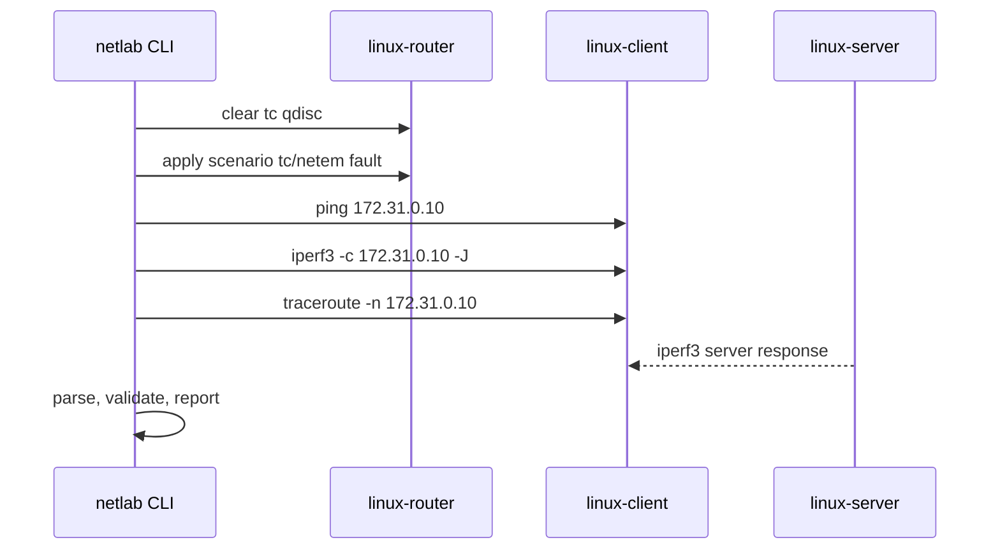

# Architecture

`linux-network-validation-lab` is organized as a host-driven validation harness. The Python CLI runs
on the host, while network probes run inside Linux containers.

## Module Responsibilities

| Module | Responsibility |
| --- | --- |
| `cli.py` | Typer command surface for lab lifecycle, scenario execution, and reports |
| `config.py` | Pydantic scenario models and YAML loading |
| `topology.py` | Compose lifecycle helpers and topology constants |
| `command_runner.py` | Subprocess wrapper for Docker and Docker exec commands |
| `fault_injection.py` | `tc/netem` reset and apply command generation |
| `testsuite.py` | End-to-end scenario orchestration |
| `metrics.py` | Parsers for `ping`, `iperf3`, and `traceroute` output |
| `validation.py` | Threshold evaluation and overall status |
| `reporting.py` | JSON, CSV, and HTML report generation |
| `logging_config.py` | CLI logging setup |

## Data Flow

1. A scenario YAML file is loaded and validated.
2. Any prior `tc` qdisc on the router impairment interface is cleared.
3. The scenario fault is applied when enabled.
4. Client-side tests are executed with Linux tools.
5. Raw outputs are parsed into metrics.
6. Metrics are compared with scenario thresholds.
7. Results are written as JSON, CSV, and optionally rendered to HTML.
